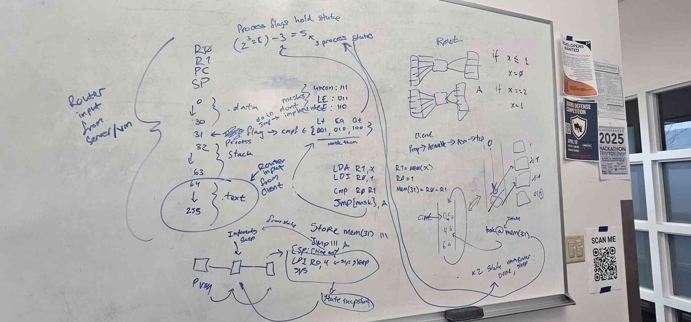

# TCP VM

use ./scripts/InitEnv.bash to setup python. most things are using my build tool
Bakery-Build that uses the `bake` command. run `bake` to see all commands and
`bake [target]` to run something specific.
